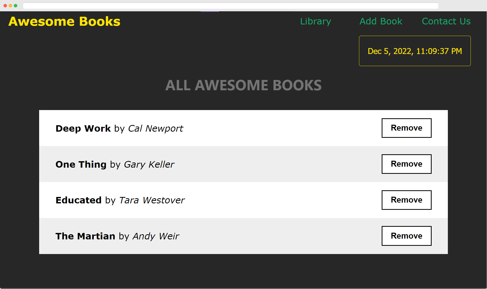

  
   

  <h3><b>Microverse Project</b></h3>

<!-- TABLE OF CONTENTS -->

# 📗 Table of Contents

- [📖 About the Project](#about-project)
  - [🛠 Built With](#built-with)
    - [Tech Stack](#tech-stack)
    - [Key Features](#key-features)
  - [🚀 Live Demo](#live-demo)
- [💻 Getting Started](#getting-started)
- [👨‍🚀 Authors](#authors)
- [🔭 Future Features](#future-features)
- [🤝 Contributing](#contributing)
- [⭐️ Show your support](#support)
- [🙏 Acknowledgements](#acknowledgements)
- [📝 License](#license)

<!-- PROJECT DESCRIPTION -->

# 📖 Awesomebooks 

**Awesomebooks** is a single-page website for managing and organizing books.

## 🛠 Built With 

### Tech Stack 

- HTML
- CSS
- JavaScript (ES6)

<!-- Features -->

### Key Features 

- **Single Page App**
- **Add/remove books**
- **View list of books**
- **Preserve data in localStorage**

(<a href="#readme-top">back to top</a>)

<!-- LIVE DEMO -->

## 🚀 Live Demo 

You can visit the live version on [Awesomebooks Website](https://indiecodermm.github.io/awesome-books/).

(<a href="#readme-top">back to top</a>)

<!-- GETTING STARTED -->

## 💻 Getting Started 

To get a local copy up and running, clone this repository to your desired folder:

(<a href="#readme-top">back to top</a>)

<!-- AUTHORS -->

## 👨‍🚀 IndieCoderMM 

- GitHub: [@IndieCoderMM](https://github.com/IndieCoderMM)
- Twitter: [@heinThantO](https://twitter.com/heinThantO)
- LinkedIn: [hthantoo](https://www.linkedin.com/in/hthantoo)

(<a href="#readme-top">back to top</a>)

<!-- FUTURE FEATURES -->

## 🔭 Future Features 

- [ ] **Pop-up notification**
- [ ] **Collect book detail**

(<a href="#readme-top">back to top</a>)

<!-- CONTRIBUTING -->

## 🤠Contributing 

Contributions, issues, and feature requests are welcome!

Feel free to check the [issues page](../../issues/).

(<a href="#readme-top">back to top</a>)

<!-- SUPPORT -->

## ⭐️ Show your support 

If you like this project, you can support me by giving a 🌟.

(<a href="#readme-top">back to top</a>)

<!-- ACKNOWLEDGEMENTS -->

## 🙠Acknowledgments 

I would like to thank everyone who supports this project.

(<a href="#readme-top">back to top</a>)

<!-- LICENSE -->

## 📠License 

This project is [MIT](./MIT.md) licensed.

(<a href="#readme-top">back to top</a>)

